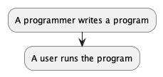
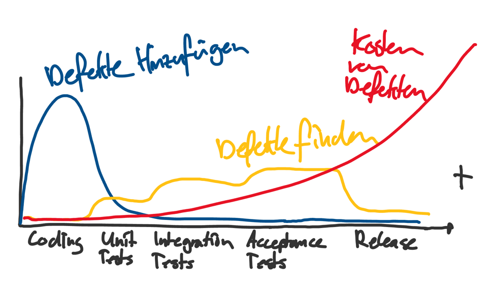
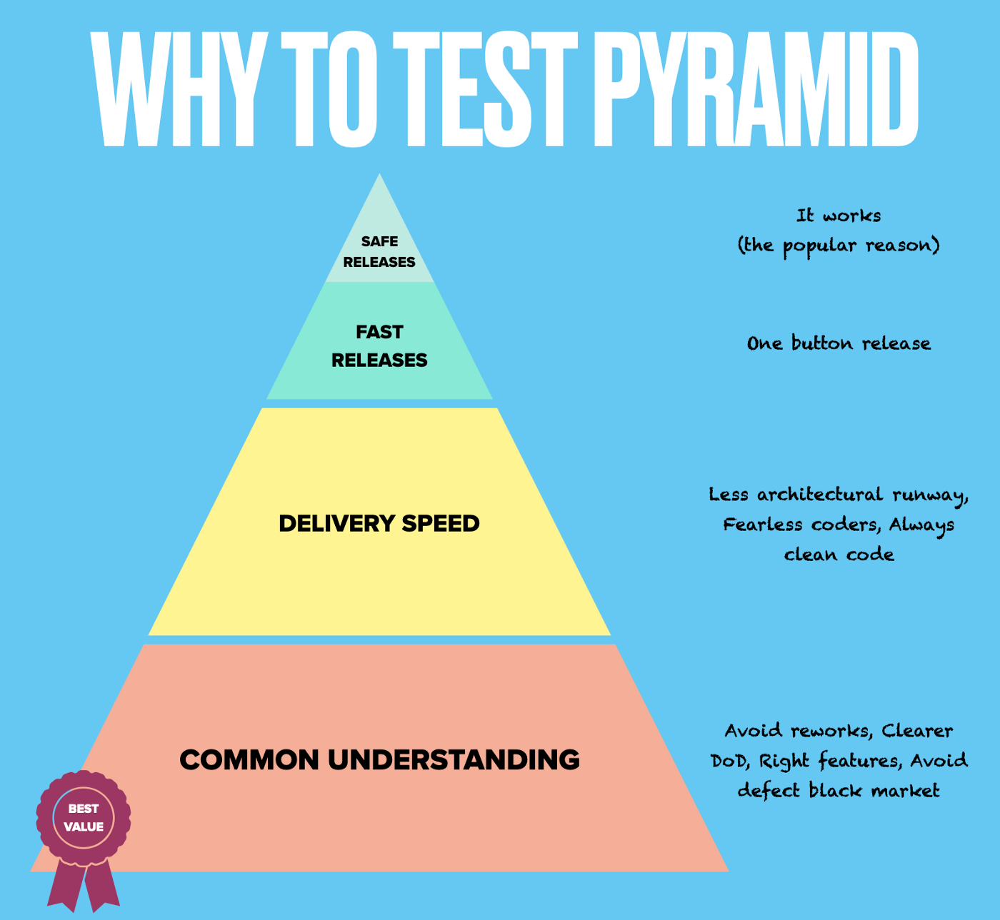
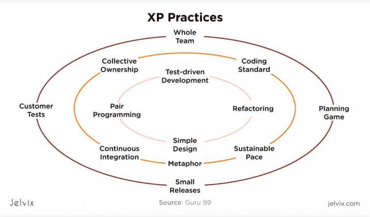
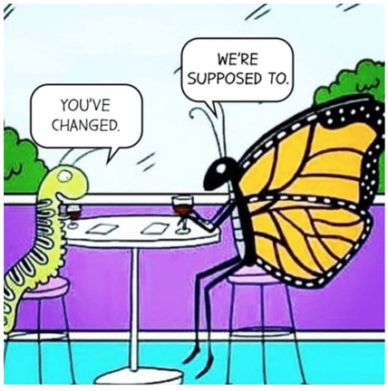

<!-- headingDivider: 2 -->

# Organisatorisches

## Vorstellung
- 2005 Maturität
- 2008 – 2016 Polymechaniker
- seit 2010 selbstständig im Nebenerwerb: Tontechnik, Akustik, Video, Softwareentwicklung
- seit 2014 Velokurier Bern (Velo, Disposition, IT)
- 2015: BSc Elektro- und Kommunikationstechnik, Vertiefung Embedded Systems
- 2015 – 2016 DSP Entwicklung, Akustik
- seit 2016 Unterricht TEKO (Softwareentwicklung, Betriebssysteme, Netzwerktechnik, Microcomputer)

## Lernziele I

Die Studierenden kennen die Methoden der objektorientierten Programmierung und können diese anwenden.
Sie sind in der Lage, mittelgrosse, vollständig objektorientierte, grafische Anwendungen zu implementieren, testen und dokumentieren.

## Lernziele II

Die Studierenden
- kennen die Konzepte Kapselung, Vererbung, Polymorphie, dynamisches Binden, abstrakte Klassen und generische Programmierung und können diese in einfachen Beispielen anwenden. können den Kontrollfluss eines Programmes mit Ausnahmebehandlung verstehen und die Vorteile erläutern.
- kennen die SOLID - Prinzipien und können sie in eigenen Worten erklären.
- kennen die verschiedenen Testarten und können einfache Unit-Tests selber schreiben.

## Lernziele II
Die Studierenden
- kennen das Vorgehen beim Test Driven Development und kennen die Bedeutung von Refactoring und Testing als integralen Teil der Softwareentwicklung.
- kennen das Vorgehen sowie Vor- und Nachteile des Pair-Programming.
- können eine GUI-Applikation entwickeln. Sie können dabei gängige objektorientierte Konzepte anwenden und den Code sinnvoll strukturieren.
- wissen, worauf sie bei der Auswahl eines Frameworks achten müssen.

## Zeitplan

Montag 18:30 – 20:00 / 20:15 – 21:45

1. KW 43: Einstieg, Entwicklungswerkzeuge
2. KW 44: Klassen und Objekte
3. KW 45: Testing, TDD
4. KW 46: Datenstrukturen
5. KW 47: Vererbung, Polymorphismus
6. KW 48: Repetition MVC
7. KW 49: statische/dynamische Bindung
8. KW 50: Clean Code
9. KW 51: Hardware, binäre Zahlendarstellung, Programmiersprachen

---

10. KW 2: 
11. KW 3: Exceptions, Fehlerbehandlung
12. KW 4:  
13. KW 5: SOLID: Single-Responsibility
14. KW 7: SOLID: Open Closed
15. KW 8: SOLID: Liskov
16. KW 9: SOLID: Interface-Segregation
17. KW 10: SOLID: Dependency-Inversion
18. KW 11: Frameworks
19. KW 12: 

## Unterlagen
- [github.com/fhirter](https://github.com/fhirter/ObjektorientierteProgrammierung)
- Literatur.pdf
- OneNote Klassennotizbuch

## Benotung


## Ratschlag
- Wenn du etwas nicht verstehst, frage! Dumme Fragen sind nur die, die nicht gestellt werden.

# Einstieg

## Design
"Any sufficiently advanced technology is indistinguishable from magic."

-- Arthur C. Clarke

## Softwareentwickler:innen bauen Maschinen
- Unsere Maschinen können nicht angefasst werden: Sie sind nicht materiell
- Wir sprechen von Programmen oder Systemen (Software)
- Um eine Softwaremaschine laufen zu lassen brauchen sie eine physische Maschine: den Computer (Hardware)

## Computer
- Computer sind universelle Maschinen. Sie führen die Programme aus, die wir ihnen füttern.
- Die einzigen Grenzen sind unsere Vorstellungskraft
- Gute Nachricht
  - Dein Computer macht genau das, was man ihm sagt.
  - Er macht es sehr schnell.
- Schlechte Nachricht
  - Dein Computer macht genau das, was man ihm sagt.
  - Er macht es sehr schnell.

## Programme erstellen und laufen lassen


## Programme erstellen und laufen lassen


## Programme erstellen und laufen lassen


## Verbreitete Mythen und Entschuldigungen
- «Computer sind intelligent»
  - Fakt: Computer sind weder intelligent noch dumm. Sie führen Programme aus, die von Menschen entwickelt wurden. 
  - Diese Programme bilden die Intelligenz ihrer Autoren ab. 
  - Die grundlegenden Computeroperationen sind elementar (Speichere diesen Wert, Addiere diese beiden Zahlen...)
- «Der Computer ist abgestürzt»
- [«Der Computer erlaubt das nicht»](https://youtu.be/0n_Ty_72Qds)
- «Der Computer hat ihren Datensatz verloren»
- [how to never write bug - Fireship.io](https://youtu.be/X3jw1JVNdPE)

## Software schreiben ist herausfordernd
- Programme können «abstürzen»
- Programme, die nicht «abstürzen» funktionieren nicht zwangsläufig richtig.
- Fehlerhafte Programme können Menschen töten, (medizinische Geräte, Luftfahrt) → Boeing 737 MCAS
- Ariane5 Rakete, 1996: $10 Milliarden verloren aufgrund eines Programmfehlers.
- Programmierer sind veranwortlich für das korrekte Funktionieren der Programme
- Das Ziel dieses Fachs ist, nicht nur programmieren zu lernen, sondern gut programmieren zu lernen.

## Grundsätzliche Organisation
<!-- Bild -->

## Computer
- Computer sind universelle Maschinen, sie führen Programme aus, die wir ihnen "füttern"
<!-- Bild -->

## Informationen und Daten
- Information ist das, was wir Menschen wollen und verstehen, z.B. ein Lied oder einen Text
  - Interpretation von Daten für Menschen
- Daten bezeichnet, wie dies im Computer gespeichert wird, z.B. als MP3 Datei.
  - Ansammlung von Symbolen in einem Computer

## Informationen und Daten
- Daten werden gespeichert
- Eingabegeräte produzieren Daten aus Informationen
- Ausgabegeräte produzieren Informationen aus Daten
<!-- Bild -->

## Wo ist das Programm?
- Stored-program computer: Das Programm ist im Speicher
  - „ausführbare Daten“
- Ein Programm kann in verschiedenen Formen im Speicher auftreten:
  - Quellcode / Sourcecode: durch Menschen lesbare Form (Programmiersprache)
  - Maschinencode: Ausführbar durch Computer
- Compiler / Interpreter transformieren von Sourcecode zu Maschinencode
- Der Computer findet das Programm im Speicher und führt es aus.

## Software Engineering
Software sollte folgende Merkmale haben:
- Korrekt: Machen, was es sollte!
- Erweiterbar: Einfach zu ändern sein!
- Lesbar: durch Menschen!
- Wiederverwertbar: Das Rad nicht neu erfinden!
- Robust: Korrekt auf Fehler reagieren!
- Sicher: Angreifer abwehren!

## Software schreiben ist herausfordernd
- Es ist schwierig, das Programm korrekt zu schreiben 
- Trial-and-error ist ineffizient

## Software schreiben macht Spass
- Entwickle deine eigene Maschine!
- Kreativität und Vorstellungsvermögen kann ausgelebt werden!
- Programme retten leben und machen die Welt besser!

# Entwicklungswerkzeuge
## Programmiersprachen

[Tiobe Index](https://www.tiobe.com/tiobe-index/)
[God-Tier Developer Roadmap](https://www.youtube.com/watch?v=pEfrdAtAmqk)

## C
- 1972, Dennis Ritchie, Bell Labs
- Kompiliert
- Imperativ, Stukturiert
- statisch Typisiert
- Grosse Verbreitung in Betriebssystemen und Embedded
- Sehr schnell und effizient

## C++
- 1985, Bjarne Stroustrup, Bell Labs
- Kompiliert
- Objektorientiert
- Erweiterung von C
- Schnell und effizient
- Hochkomplex
- Grosse Verbreitung in Betriebssystemen, Desktop Applikationen, Games, Datenbanken, Interpreter

## Java
- 1995, James Gosling, Sun Microsystems
- Kompiliert / Virtuelle Maschine (Plattformunabhängigkeit)
- Objektorientiert
- statisch Typisiert
- Grosses angebot an Bibliotheken und Werkzeugen 
- Einfache Syntax

## C#
- 2000, Anders Hejlsberg, Microsoft
- Kompiliert
- Objektorientiert
- statisch Typisiert
- Game Entwicklung (Unity), Microsoft Ökosystem

## Python
- 1991, Guido van Rossum, Centrum Wiskunde & Informatica
- Interpretiert
- Objektorientiert
- dynamische Typisierung
- Einfache Syntax, schlanke Programme, wenig Ballast
- Grosses Angebot an Bibliotheken und Werkzeugen

## PHP
- 1995, Rasmus Lerdorf
- Interpretiert
- Objektorientiert
- dynamische Typisierung
- Im Web weit verbreitet (Backend)

## JavaScript / TypeScript
- 1995, Brendan Eich, Netscape
- Interpretiert
- Objektorientiert (Prototypenbasiert)
- dynamische Typisierung
- statische Typisierung mit TypeScript, 2014, Microsoft
- Hohe Verbreitung im Web (Frontend und Backend)

## Rust
- 2015, Graydon Hoare, Mozilla
- Kompiliert
- Objektorientiert, nebenläufig
- statische Typisierung
- Keine Garbage Collection
- Sicher, Nebenläufig
- Seit 2022 im Linux Kernel verwendet

## Go
- 2012, Rob Pike / Ken Thompson / Robert Griesemer, Google
- Kompiliert
- Objektorientiert, nebenläufig
- statische Typisierung
- Keine Vererbung
- Effizienz, Lesbarkeit / DX, Networking, Multiprocessing

## Energy, Time, Memory Comparision


## Entwicklungsumgebungen


## Entwicklungsumgebungen
### Eclipse
- JavaScript/TypeScript, C/C++, PHP, Rust etc
- Open Source 

### Microsoft Visual Studio
- VB, C, C++, C##, SQL, TypeScript, Python, HTML, JavaScript, CSS
- Closed Source

---

### Microsoft Visual Studio Code
- JavaScript, TypeScript, HTML, CSS, etc
- Open Source, Proprietär, frei

### JetBrains
- Java, Kotlin, Groovy, Scala, JavaScript, TypeScript, C (CLion), PHP (PHPStorm), Ruby (RubyMine), Python (PyCharm), iOS (AppCode), Android (AndroidStudio), C## (Rider)
- Teilweise OpenSource (Community Version)

## Jetbrains PyCharm


## Debugging


## Versionsverwaltung Basics
- Protokollierung von Änderungen
- Wiederherstellung von alten Ständen
- Archivierung
- Koordinierung des gemeinsamen Zugriffs 
- Entwicklungszweige (Branches) -> [Don’t Branch!](https://www.youtube.com/watch?v=v4Ijkq6Myfc)

## Moderne Versionsverwaltung
- [CI/CD](https://www.redhat.com/cms/managed-files/ci-cd-flow-desktop_edited_0.png)
- [GitOps](https://www.atlassian.com/git/tutorials/gitops)
- [Infrastructure as Code](https://en.wikipedia.org/wiki/Infrastructure_as_code)
- Documentation as Code 
  - [Markdown](https://www.markdownguide.org/)
  - [MKDocs](https://www.mkdocs.org/) 
  - [PlantUML](https://plantuml.com/de/)
- Everything as Code

## Git
- Fast jede Funktion arbeitet lokal
- Git stellt Integrität sicher
- Git fügt im Regelfall nur Daten hinzu
- [Download](https://git-scm.com/downloads)

[Was ist Git](https://git-scm.com/book/de/v2/Erste-Schritte-Was-ist-Git%3F)

## Die drei Zustände
- Modified
- Staged
- Committed


## Arbeiten mit Git
### Initialisieren
- Auf Github oder Gitlab ein leeres Projekt erstellen
- [Dieses Projekt lokal klonen](https://git-scm.com/docs/git-clone) `git clone`
- User name setzen: `git config user.name <name>`

---

### Arbeitsablauf
- [Lokales Repository aktualisieren](https://git-scm.com/docs/git-pull) `git pull origin`
- Source Dateien erstellen oder editieren
- [Änderungen zum Staging Area hinzufügen](https://git-scm.com/docs/git-add) `git add <directory>` (z.B. ".")
- [Änderungen im Repository festhalten](https://git-scm.com/docs/git-commit) `git commit -m "<message>"` (z.B. "change data type")
- [Lokales Repository aktualisieren](https://git-scm.com/docs/git-pull) `git pull <remote>` (z.B. "origin")
  - Mit Rebase bleibt die History aufgeräumter: `git pull --rebase`
- [Änderungen auf Github/Gitlab/Bitbucket laden](https://git-scm.com/docs/git-push) `git push <remote> <branch>` (z.B. "origin main")

## CI/CD mit Git
- Tests und Linter werden bei Commit automatisch ausgeführt und Commit ggf. abgelehnt.
- Mit Tags werden Releases markiert. [semantic versioning](https://semver.org/).
- Das neuste Release wird automatisch deployed.
- [Changelogs werden automatisiert anhand der Git Messages generiert](https://medium.com/agoda-engineering/automating-versioning-and-releases-using-semantic-release-6ed355ede742)


## Commit Messages
- [Your Git Commit History Should Read Like a History Book](https://betterprogramming.pub/your-git-commit-history-should-read-like-a-history-book-heres-how-7f44d5df1801)
```
feat(logging): added logs for failed signups
fix(homepage): fixed image gallery
test(homepage): updated tests
docs(readme): added new logging table information
```

## PyCharm Git Integration


---


## Ressourcen
- [Cheatsheet](https://www.atlassian.com/git/tutorials/atlassian-git-cheatsheet)
- [Atlassian Tutorials](https://www.atlassian.com/git/tutorials/what-is-version-control)
- [Git Tutorials](https://git-scm.com/book/de/v2/Erste-Schritte-Was-ist-Git%3F)
- [Simulationstool](https://learngitbranching.js.org/)

# Klassen und Objekte
## Eine Klasse: eine Software Maschine
<!-- bild? -->

## Was ist ein Objekt?
Es gibt verschiedene Arten von Objekten:
- “physische Objekte”: bilden physische Objekte ab, z.B. eine Ampel oder ein Auto
- “abstrakte Objekte”: Beschreiben abstrakte Dinge aus der modelierten Welt, z.B. eine Route oder eine Himmelsrichtung
- “Softwareobjekte”: Reine Softwareelemente, z.B.“Datenstrukturen wie Arrays oder Listen
- Ein grosser Vorteil der objektorientierten Programmierung ist, dass die Software anhand der «echten» Welt modeliert werden kann.

## Was ist ein Objekt?
- Ein Objekt besitzt Daten → Eigenschaften / Felder
- Ein Objekt kann Operationen ausführen → Funktionen / Methoden 

Ein Objekt kann Operationen ausführen und dazu auf seine Daten zugreifen und diese ändern.

## Methoden
- Entspricht dem Begriff "Funktion" der strukturierten Programmierung
- Eine Operation, die von Objekten ausgeführt werden kann.
- Abfragen, Befehle
- Name der Methode kann, mit Einschränkungen, frei gewählt werden.
- Eine Methode von einem Objekt wird in den meisten Sprachen mit dem `.` aufgerufen: `<objekt>.<methode> 

## Methoden
- Methoden können Argumente haben:
  - primaryStage.setTitle("Ampelsteuerung");
- Mehrere Argumente werde durch Komma getrennt:
  - primaryStage.add(crossroadController, 1100, 900);
- Weniger Argumente sind übersichtlicher! (Faustregel: Max. 3)

## Ein Objekt hat eine Schnittstelle (Interface)


## Ein Objekt hat eine Implementierung


# Abstraktion
- Ein Objekt kann verwendet werden, ohne die Implementierung der Methoden zu kennen.
- Die Implementierungsdetails sind abstrahiert

## Kapselung
- Grundsätzlich sind alle Felder (Daten) privat, d.h. nur für das eigene Objekt zugänglich.
- Diese Felder stellen den Zustand (State) des Objekts dar.
- Zugriff auf Felder wird mit Methoden gewährt (sogenannte Setter und Getter, z.B. setColor(), getSize()
- Es werden nur die nötigen Methoden zugänglich gemacht.
- Die Programmiersprache stellt den Zugriffsschutz sicher.

## Objektorientierung: Geschichte
- Untergruppe der imperativen Programmierung (Abfolge von Befehlen)
- Ursprung: Simula67, Oslo, 60er Jahre
- Kaum verbreitet in den 70er Jahren
- Smalltalk (Xerox PARC, 1970s) machte OOP Populärer

---

- Grosser Verbreitung in den 90er Jahren
- Die meisten heute verbreiteten Sprachen sind objektorientiert: Objective C, C++, Java, C#, Python, Kotlin, Go, JavaScript, uvm
- Heute das meistverbreitete Konzept der Softwareentwicklung
- Andere Programmierparadigmen:
  - Imperative Programmierung
    - Strukturierte Programmierung
    - Prozedurale Programmierung
  - Deklarative Programmierung
    - funktionale Programmierung

## Syntaktische Struktur einer Klasse
```
class Vehicle:                                 # Class Name
    def __init__(self, brand, model, type):    # Constructor
        self.brand = brand
        self.model = model
        self.type = type
        self.gas_tank_size = 14
        self.fuel_level = 0

    def fuel_up(self):                          # Method declaration
        self.fuel_level = self.gas_tank_size    # Method implementation
        print('Gas tank is now full.')

    def drive(self):
        print(f'The {self.model} is now driving.')

```

## Klasse
- Jedes Objekt gehört zu einer Klasse, welche die zur Verfügung stehenden Methoden und Felder definiert.
- Eine Klasse ist eine Beschreibung von Laufzeit-Objekten, welche dieselben Eigenschaften und Methoden besitzen.
- Eine Klasse ist eine Kategorie von Dingen
- Ein Objekt ist eines von diesen Dingen

## Objekte
Wenn ein Objekt O ein Objekt der Klasse C ist:
- O ist ein Exemplar von C
- O ist eine Instanz von C


## Objekte und Klassen
- Klassen existieren nur im Source Code
  - Bauplan für konkrete Objekte
- Objekte existieren nur zur Laufzeit

---

- Ein zentraler Aspekt der Softwareentwicklung ist das Bilden von sinnvollen Klassen für die Aufgabenstellung (Softwarearchitektur, OOD)
- Das Schreiben der Details wird Implementierung genannt.

## Interface (de: Schnittstelle)
- Die Schnittstelle (engl. interface) ist der Teil eines Systems, welcher der Kommunikation dient.
- Der Begriff stammt ursprünglich aus der Naturwissenschaft [...]. Er beschreibt bildhaft die Eigenschaft eines Systems als Black Box, von der nur die „Oberfläche“ sichtbar ist, und daher auch nur darüber eine Kommunikation möglich ist. [...]
- Daneben bedeutet das Wort „Zwischenschicht“: Für die beiden beteiligten Boxes ist es ohne Belang, wie die jeweils andere intern mit den Botschaften umgeht, und wie die Antworten darauf zustande kommen.


## Interfaces
- User interface: Wenn die Clients Menschen sind
  - GUI: Graphical User Interface
  - Text interfaces, command line interfaces.
- Program interface: Wenn die Clients Software sind
  - API: Application Program Interface

## API
- Eine Schnittstelle gibt an, welche Methoden vorhanden sind oder vorhanden sein müssen.
- Zusätzlich zu dieser syntaktischen Definition sollten Vorbedingungen und Nachbedingungen der verschiedenen Methoden definiert werden.
- Heute werden dazu in der Regel automatisierte Tests geschrieben.
- Es kann auch in der Dokumentation festgehalten werden.

## Schnittstellen definieren
- Nicht jede Methode ist für jeden möglichen Parameter geeignet
- Lösungen:
  - immer: gute Wahl der Bezeichner
  - möglichst immer: Tests
  - Einschränkung durch Datentyp
  - wenn nötig: Kommentare: JavaDoc
  - falls erforderlich: Exceptions

## Javadoc


## UML Klassendiagramm

[PlantUML](https://www.plantuml.com/)

## UML Klassendiagramm


## PlantUML
```
@startuml
class Konto {
    bezeichnung
    saldo()
    einzahlen(betrag)
}

class Kunde {
}

class Privatkunde {
    vorname
    nachname
}

class Geschäftskunde {
    firmenname
}

class Adresse {
}

Kunde <|-- Privatkunde
Kunde <|-- Geschäftskunde

Privatkunde "0..*" -- "1" Adresse
Geschäftskunde "0..*" -- "1" Adresse

Konto "1..*" -- "1..*" Kunde
@enduml
```

# Moderne Softwareentwicklung

## Software Engineering
 

## Kundenorientierung
**Software soll den Kunden Mehrwert bringen**
- Software soll stabil laufen
- Neue Features sollten schnell umgesetzt und nutzbar sein
- Softwaresysteme werden immer komplexer

## Teamarbeit
- Mehrere Personen arbeiten am selben Softwareprojekt
- Versionsverwaltung wird verwendet (Git, SVN)
- Konflikte entstehen und sind aufwendig

## Lösungen
- Kleine Arbeitspakete iterativ und inkrementell
- Kurzer Feedbackloop
- Komplexität reduzieren
- Hohe Qualität

## Alles hängt zusammen
- Hohe Qualität reduziert Komplexität
- Hohe Qualität kürzt den Feedbackloop durch schnelle Entwicklung
- Kleine Arbeitspakete kürzen den Feedbackloop
- Kleine Arbeitspakete reduzieren Komplexität
- ...

## Manifesto for Agile Software Development
* Individuals and interactions over processes and tools
* Working software over comprehensive documentation
* Customer collaboration over contract negotiation
* Responding to change over following a plan

https://agilemanifesto.org/

## Iteratives und inkrementelles Arbeiten


## Iterationen


## Kurzer Feedbackloop: CI/CD


## CI / CD
- Ziel: Releases werden vereinfacht
- Time to market ist kürzer, neue Features sind sofort verfügbar
- Durch automatisierte deployments ist der Aufwand initial höher, anschliessend jedoch sehr klein
- Nur möglich mit automatisierten Tests

# Testing

## Kosten von Defekten


## Kosten von Defekten


## Pair Programming


## Test Driven Development (TDD)


## Why Should You Refactor?
* Refactoring Improves the Design of Software
* Refactoring Makes Software Easier to Understand
* Refactoring Helps You Find Bugs
* Refactoring Helps You Program Faster

## When Should You Refactor?
* [The Rule of Three](https://en.wikipedia.org/wiki/Rule_of_three_(computer_programming))
* Refactor When You Add Functionality
* Refactor When You Need to Fix a Bug
* Refactor As You Do a Code Review

---



## Testing: AAA
- Arrange: Set up your data
- Act: Execute code under Test
- Assert: Verify that the result ist correct

## Testing: Further Reading
- [How to write clear and robust unit tests: the dos and don'ts](https://levelup.gitconnected.com/how-to-write-clear-and-robust-unit-tests-the-dos-and-donts-5021c097d041)
- [The Real Value of Testing](https://drpicox.medium.com/the-real-reason-to-do-testing-6f12b410dde3)


## Extreme Programming


## Embrace Change
